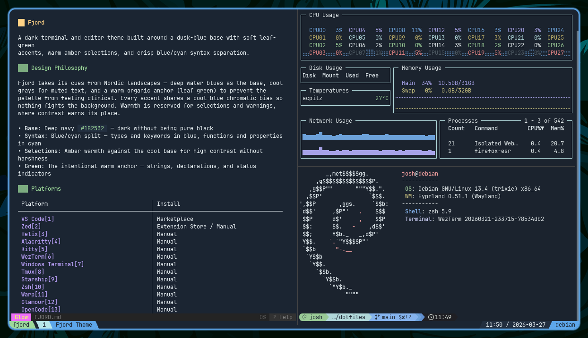
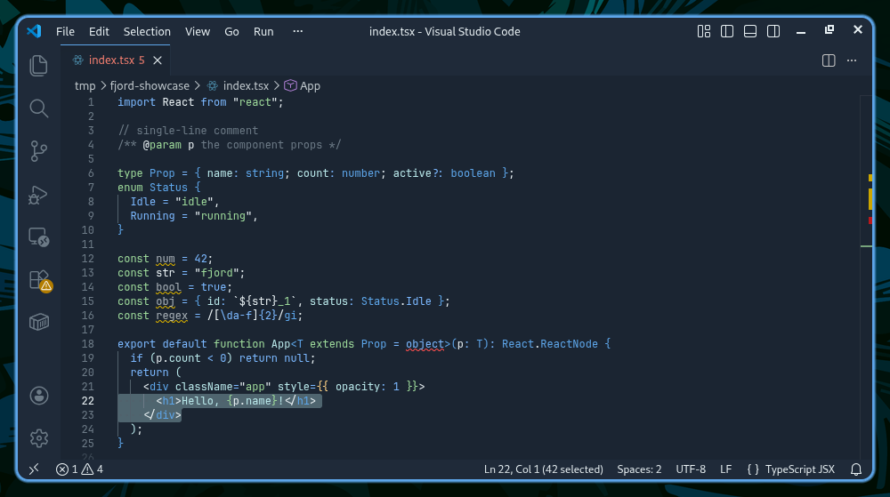
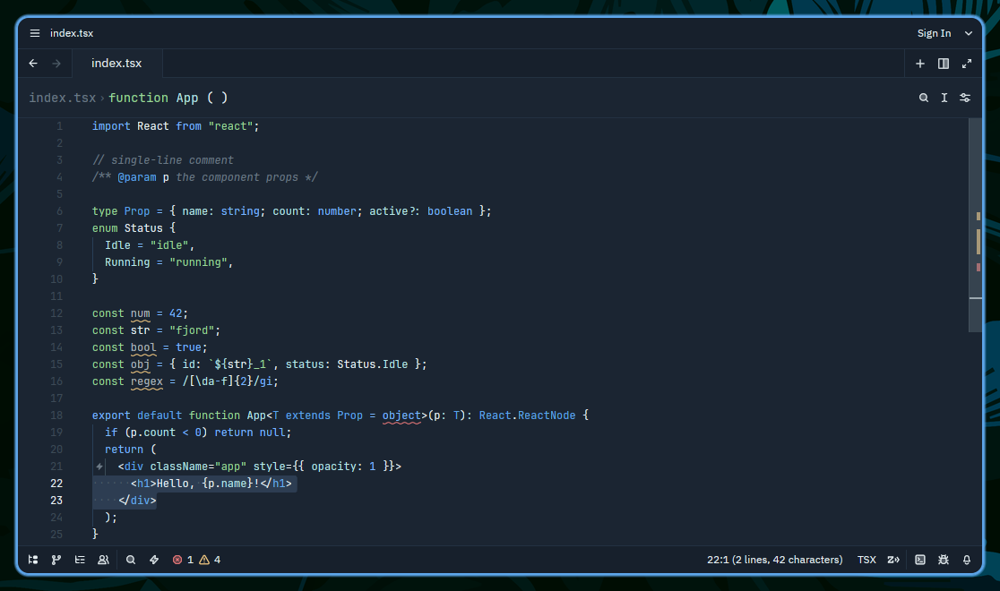
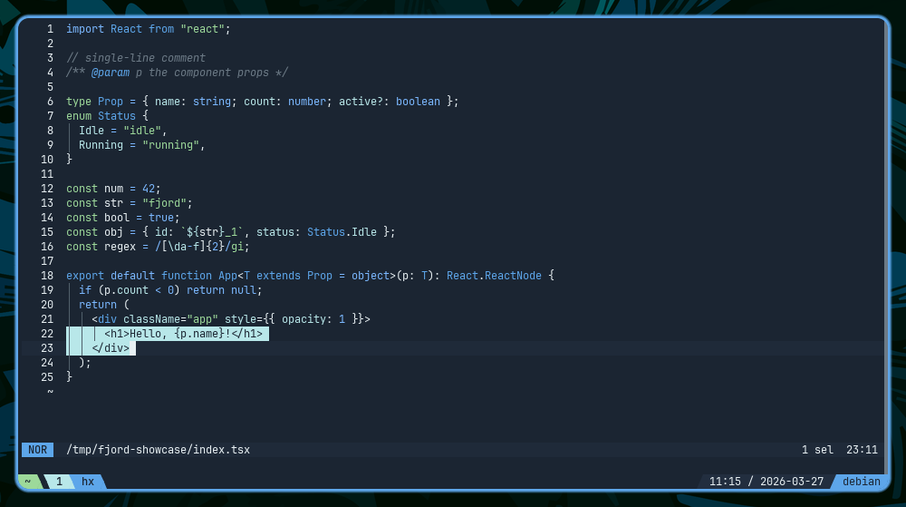
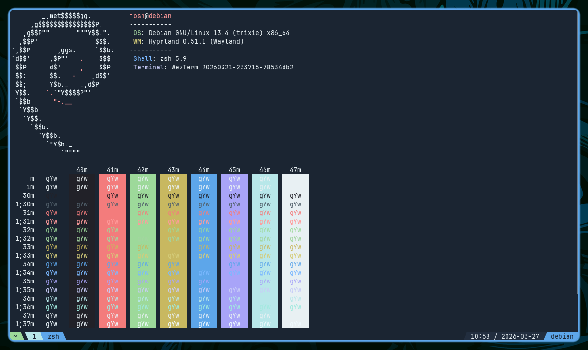
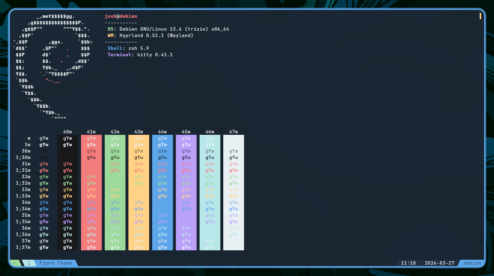
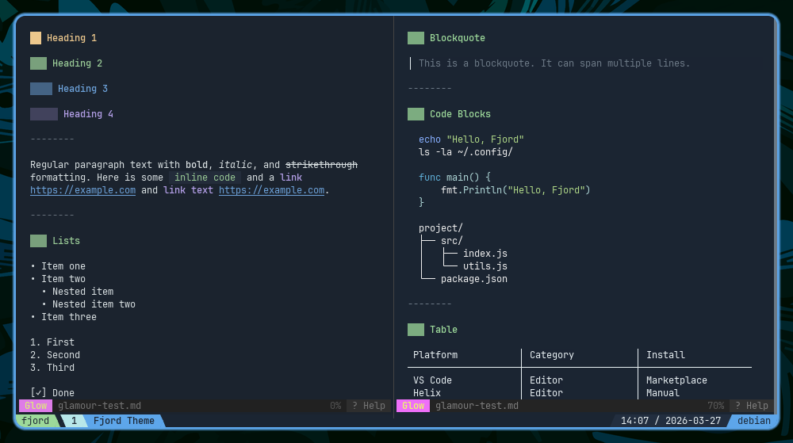

 

# Fjord

A calming color scheme with a dusk-blue base, soft leaf-green accents, cyan selections, and crisp blue-cyan separation.

 

 

| | | | | | | |
|:---:|:---:|:---:|:---:|:---:|:---:|:---:|
|  |  |  |  |  |  |  |
| `#1B2532` | `#9DD99A` | `#5DA6EA` | `#FFD285` | `#B9A0F8` | `#F37C7C` | `#B8E7E9` |
| Background | Green | Blue | Yellow | Purple | Red | Cyan |

 

<table>
  <tr>
    <td width="50%"></td>
    <td width="50%"></td>
  </tr>
  <tr>
    <td width="50%"></td>
    <td width="50%"></td>
  </tr>
  <tr>
    <td width="50%"></td>
    <td width="50%"></td>
  </tr>
</table>

 

---

**Editors** &nbsp;·&nbsp; [VS Code](https://github.com/fjord-themes/fjord-vscode) &nbsp;·&nbsp; [Zed](https://github.com/fjord-themes/fjord-zed) &nbsp;·&nbsp; [Helix](https://github.com/fjord-themes/fjord-helix) &nbsp;·&nbsp; [OpenCode](https://github.com/fjord-themes/fjord-opencode)

**Terminals** &nbsp;·&nbsp; [Kitty](https://github.com/fjord-themes/fjord-kitty) &nbsp;·&nbsp; [Alacritty](https://github.com/fjord-themes/fjord-alacritty) &nbsp;·&nbsp; [WezTerm](https://github.com/fjord-themes/fjord-wezterm) &nbsp;·&nbsp; [Warp](https://github.com/fjord-themes/fjord-warp) &nbsp;·&nbsp; [Windows Terminal](https://github.com/fjord-themes/fjord-windows-terminal)

**Tools** &nbsp;·&nbsp; [Tmux](https://github.com/fjord-themes/fjord-tmux) &nbsp;·&nbsp; [Starship](https://github.com/fjord-themes/fjord-starship) &nbsp;·&nbsp; [Zsh](https://github.com/fjord-themes/fjord-zsh) &nbsp;·&nbsp; [Glamour](https://github.com/fjord-themes/fjord-glamour)

 

